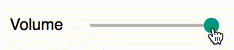
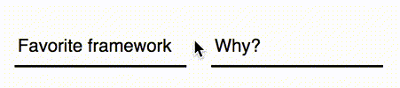

# batteries-components [](https://travis-ci.org/batteries-css/batteries-components)

This repository contains experimental CSS components used as an extension to [batteries-layout](https://github.com/batteries-css/batteries-layout). The components try to resemble a style similar to Google's material design, however they don't require any JavaScript at all and look good  even if a user doesn't allow websites to execute scripts. 


## Components

### Button


Buttons look similar to the material design ones. They support various [colors](src/definitions/colors.less) and an `inverted` mode. 

```html
<a href="#" class="red button">red button</a>
<a href="#" class="inverted deep orange button">deep orange button with white background</a>
```


### Inputs

#### Range



Ranges support colors and a disabled state: 

```html
<input type="range" disabled>
<input type="range" class="teal range">
```

#### Floating text/password/number inputs



Inputs can have a floating label, and also support colors: 

```html
<div class="teal floating label input">
  <input type="text" placeholder="e.g. 12345">
  <label>ZIP code</label>
</div>
```

In order to let the label float around, you will need to provide a placeholder. The inputs use the `:placeholder-shown` selector internally to decide whether to float or not to float (that's because we don't have a `:dirty` selector yet, and marking fields as `required` can break form UX with optional fields).


## Quick start

- [Download a release](https://github.com/batteries-css/batteries-components/releases/latest)
- Clone the repository
	- then run `yarn install` to install the dependencies
	- and `yarn build` to build the components
	- or `yarn start` to start a development server


## Bugs and feature requests

Remember that this project is an extension to an experiment, so there's no guarantee it will actually work in production. If you find a bug or you have an idea of how to improve batteries-components, just [file a new issue](https://github.com/batteries-css/batteries-components/issues/new). 


## License

All code in this repository is released under the [MIT license](LICENSE). 
